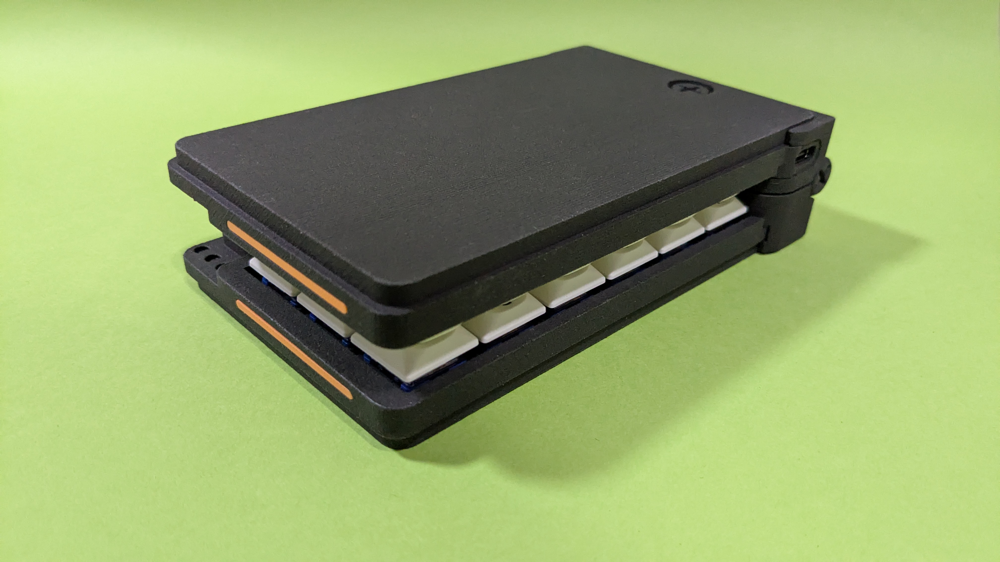
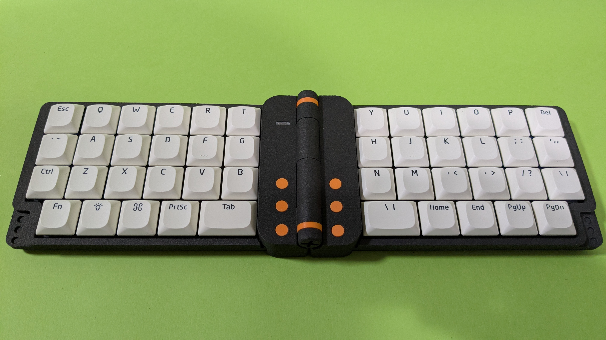

# Dottie FlipFlow

[ShopSite](https://mogma-products.booth.pm/items/6564751)

## What's Dottie FlipFlow
- The keyboard has a hinge in the center, allowing it to fold up.
- It is thin and can be equipped with Choc V1, V2, and Lofree key switches.
- This keyboard only supports lowprofile keycaps.
- We are very sorry, but this keyboard is not released as open source.

## What is this repository?
- This is a repository for publishing files and manuals required by users.
