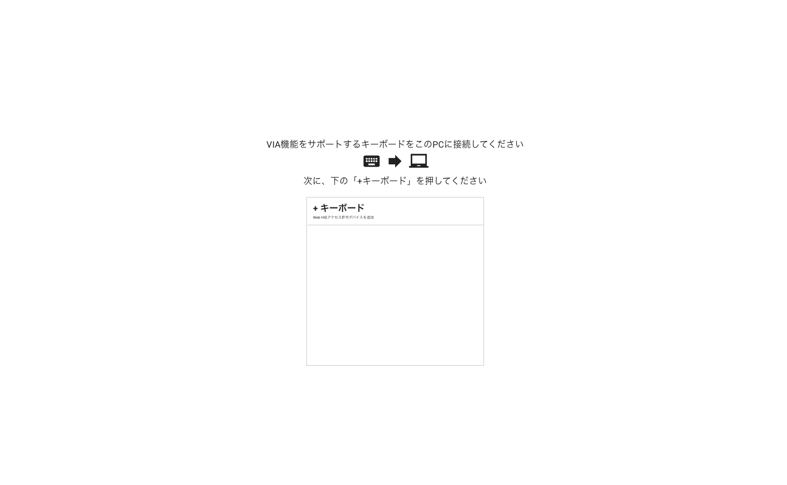
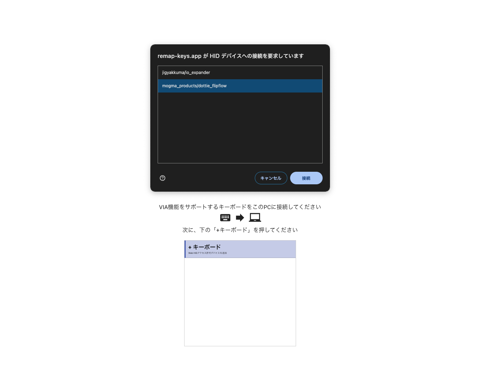
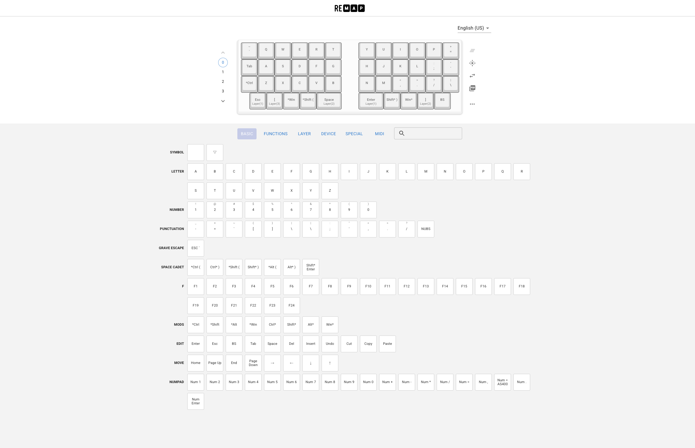

# キーマップの設定

キーマップの設定はRemapで行います。  

1. Dottie FlipFlowをPCに接続します。

1. ブラウザより以下のサイトにアクセスしてください。  
https://remap-keys.app/configure

## 初回やること
初回アクセスの場合はキーボードへの接続が必要となるため、Dottie FlipFlowを選択して接続を行ってください。
1. `+キーボード` をクリック

1. `mogma_products/dottie_flipflow` を選択して`接続`をクリック

## キーマップ設定
1. キーコンフィグ画面が開いたらお好みのキーマップに変更してください。
